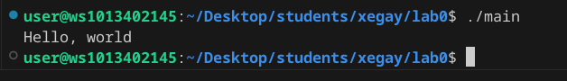
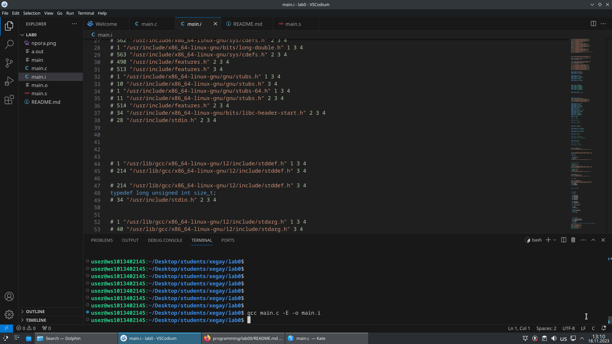
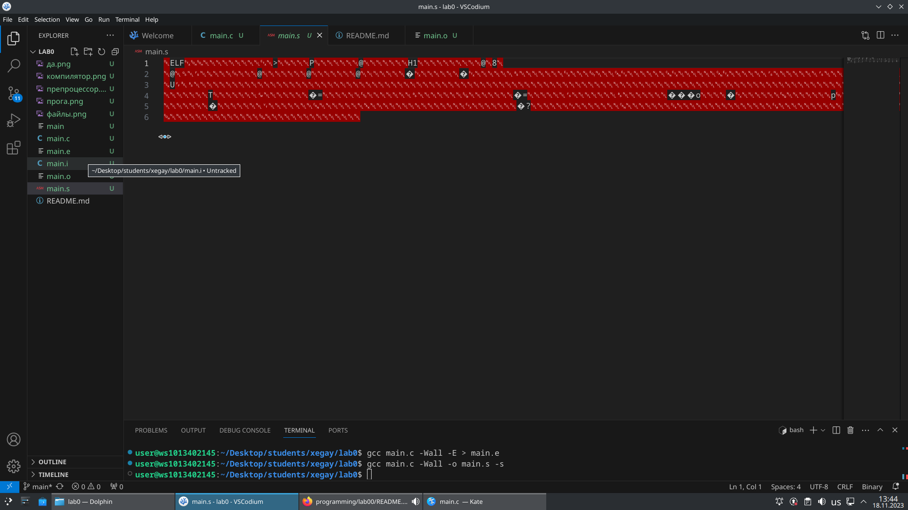
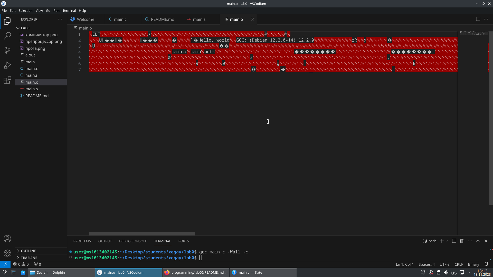
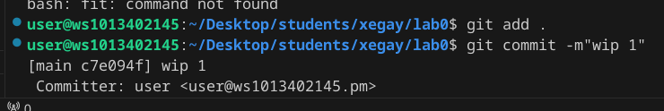
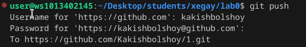

 ## Задание
1. Создайте репозиторий для дисциплины на GitHub.
2. Склонируйте его себе на ПК.
3. Напишите свою первую программу.
4. Скомпилируйте и запустите её.
5. Получите по отдельности результаты каждого этапа компиляции.
6. Напишите отчёт в README.md. Отчёт должен содержать:
* Задание
* Описание проделанной работы
* Консольные команды
* Скриншоты результатов
* Ссылки на используемые материалы
* Сделайте коммит и пуш.
* Добавьте для себя в отчёт шпаргалку по работе с git.
 ## Ход работы

### 1. Создайте репозиторий на git.hub
ссылка на репозиторий: https://github.com/armagadin/Laboratornie.git
 
 ### 2.Склонируйте его себе на пк
```shell
git clone https://github.com/Kakishbolshoy/1.git
```
  ### 3.Моя первая программа 
 ``````#include <stdio.h>

 int main(void)
 { 
    printf ("Hello world!\n");
  return 0;
  }
  ``````
  ### 4.Cкомпилируйте и запустите ее

### 5.Получите по отдельности этапы компиляции
#### Препроцессор

#### Компилятор

#### Объектные файлы


### 6. Сделайте commit и push



### 7. В качестве шпаргалки выступает вся эта работа, в которой показаны действия различных команд
### Команды для работы с GitHub
  1. `git add` добавляет содержимое рабочей директории в индекс.
  2. `git commit` берёт все данные, добавленные в индекс с помощью `git add`, и сохраняет их слепок во внутренней базе данны.
  3. `git pull`  забирает изменения из указанного удалённого репозитория, а затем пытается слить их с текущей веткой.
  4. `git push` используется для установления связи с удалённым репозиторием, вычисления локальных изменений отсутствующих в нём, и собственно их передачи в вышеупомянутый репозиторий. 
  5. `git remote` служит для управления списком удалённых репозиториев.
  6. `git init` инициализирует репозиторий.


