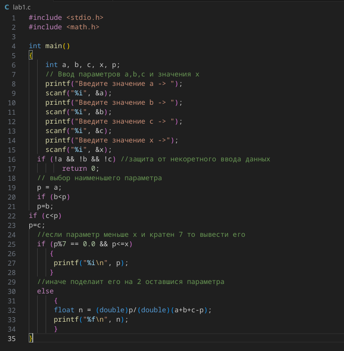
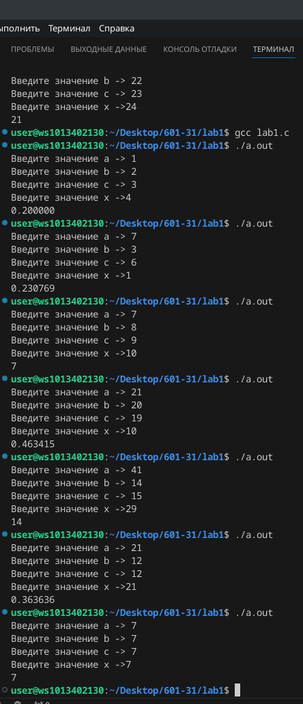

# Лабраторная №1

Задание: написать программу которая будет выводить наименьшее значение из трёх параметров a, b, c, если параметр меньше или равен x и кратен 7, иначе вывести частное от наименьшего параметра и суммы двух оставшихся.

## Программа

### Примеры результатов

