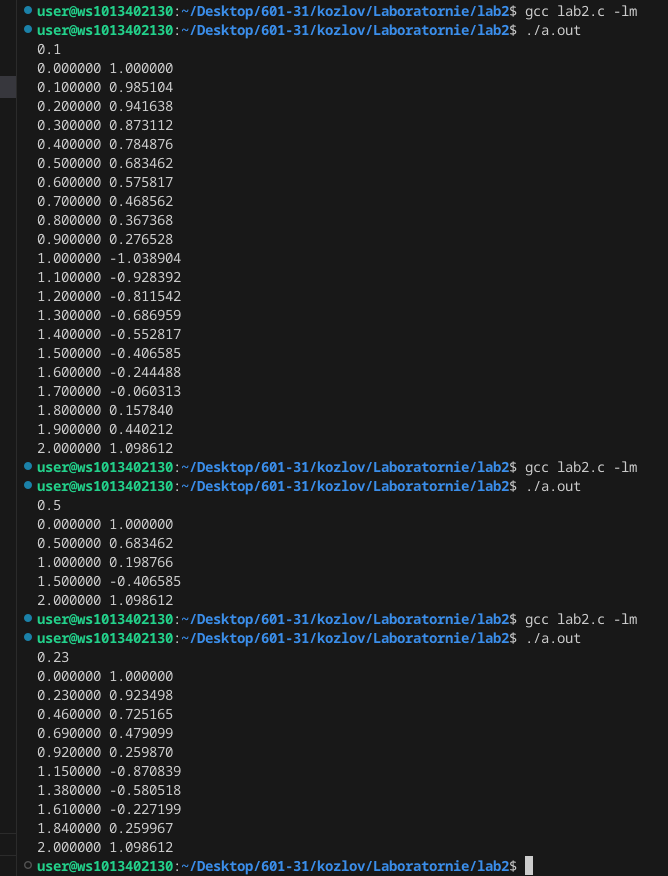
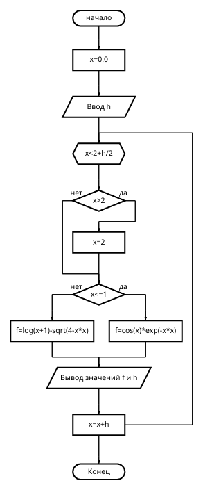
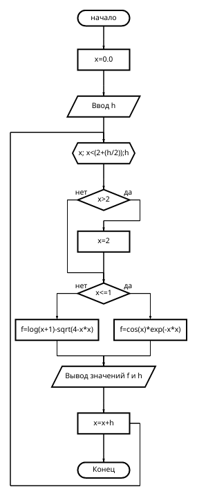
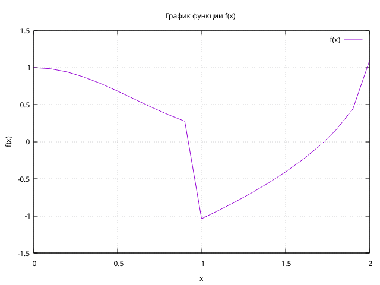

 # Задание
 Написать программу, используя циклы while и for, которая будет выводить таблицу значений функции f(x), с заданным шагом, и построить по ней график функции, используя оператор цикла while.
$$ f(x) = 
    \begin{cases}
       {cos(x)e^{-x^2}},       &\ 0\leq x \leq 1;\\ 
       ln(x+1)-\sqrt{4-x^2},   &\ 1\leq x \leq 2.\\
       \end{cases}
$$
## Инструкция для запуска программы 
1. Открыть файл lab2.c
2. Ввести в терминале команду gcc lab2.c
3. Ввести команду ./a.out.
4. Ввести значение h для задания значения шага.
5. Чтобы передать полученные значения в файл нужно ввести ./prog > my_graph.txt, где prog - это исполняемый файл вашей программы, my_graph.txt - файл, куда она будет осуществлять вывод вместо терминала.
6. Теперь создаём файл plot.gpi со следующим содержимым:
``````
#!/usr/bin/env -S gnuplot -persist
# set terminal png enhanced
# set output "my_graph.png"
set xlabel "x" 
set ylabel "f(x)"
set grid
set title "График функции f(x)"
plot "my_graph.txt" with lines title "f(x)"
``````
7. Выполняем команду chmod +x plot.gpi.
8. Строим график с помощью команды ./plot.gpi
9. Сохранить файл с графиком вручную с помощью кнопки в появившемся окне.
## Код с использованием оператора цикла while
```
#include <stdio.h>
#include <math.h>

int main() 
{
float x,f,h;
    x=0.0;
scanf("%f",&h);
while(x<2+h/2)
{
if(x>2)
x=2;
if (x<=1)
 f=cos(x)*exp(-x*x);
else
f=log(x+1)-sqrt(4-x*x);
printf("%f %f\n",x,f);
x=x+h;}
}
```
## Код с использованием оператора цикла for
``````
#include <stdio.h>
#include <math.h>

int main() 
{
float x,f,h;
    x=0.0;
scanf("%f",&h);
for(x;x < (2+(h/2));h)
{
if(x>2)
x=2;
if (x<=1)
 f=cos(x)*exp(-x*x);
else
f=log(x+1)-sqrt(4-x*x);
printf("%f %f\n",x,f);
x=x+h;}
}
``````
## Примеры значений которые получаются в резальтате роботы кода.

## Блок схема для циклf while

## Блок схема для цикла for

## График функции


